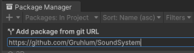
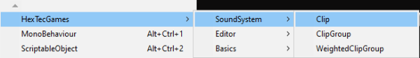
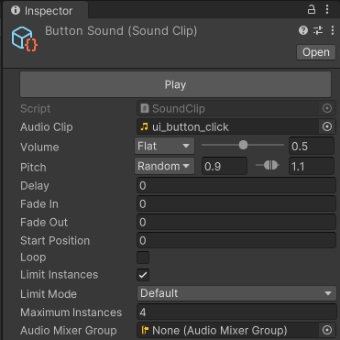
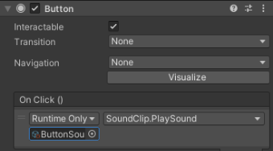
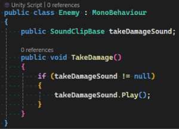

<h1>
    Easy Sound System for Unity
</h1>

> **Easily implement Music and Sound into your Unity Project!**

## 🚀 Quick Start

1. Install this package and the [Basics Package](https://github.com/Gruhlum/Basics).

2. Create a **Sound Clip** ScriptableObject.

3. Assign an **Audio Clip** to the **Sound Clip** and customize the values to your liking.

4a. Drag the **Sound Clip** into any **Unity Event** and call the **PlaySound()** method.

4b. Or add a reference to the **Sound Clip** inside a script and call the **Play()** method.

